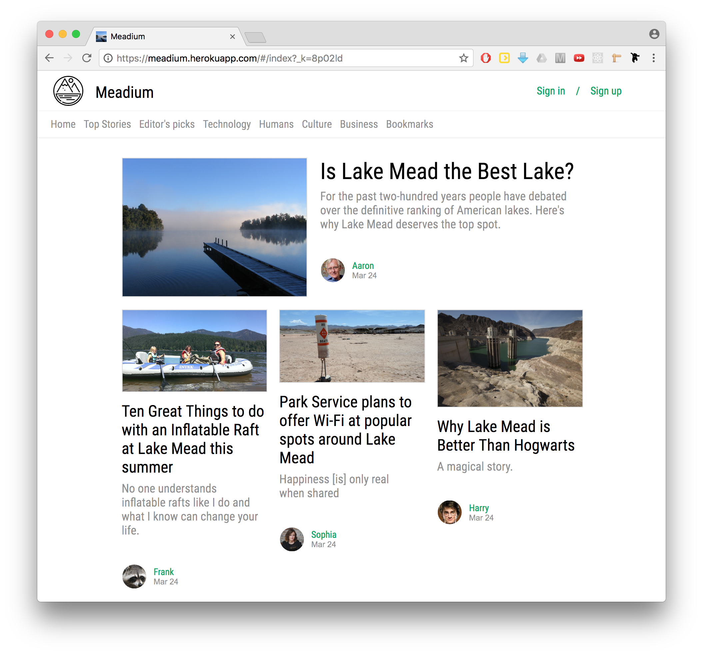
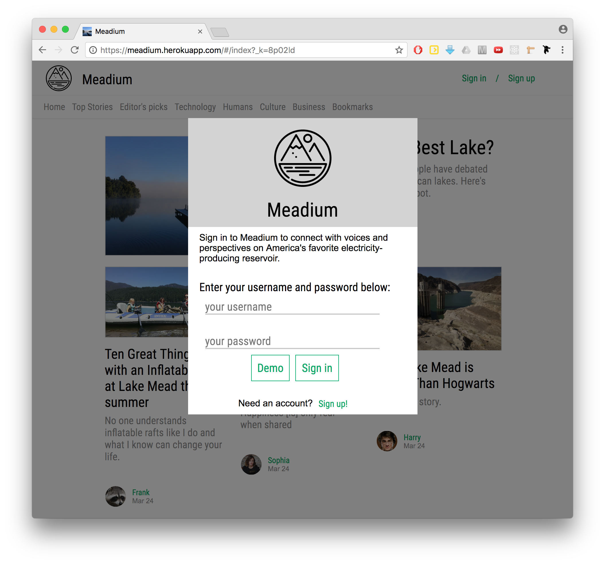
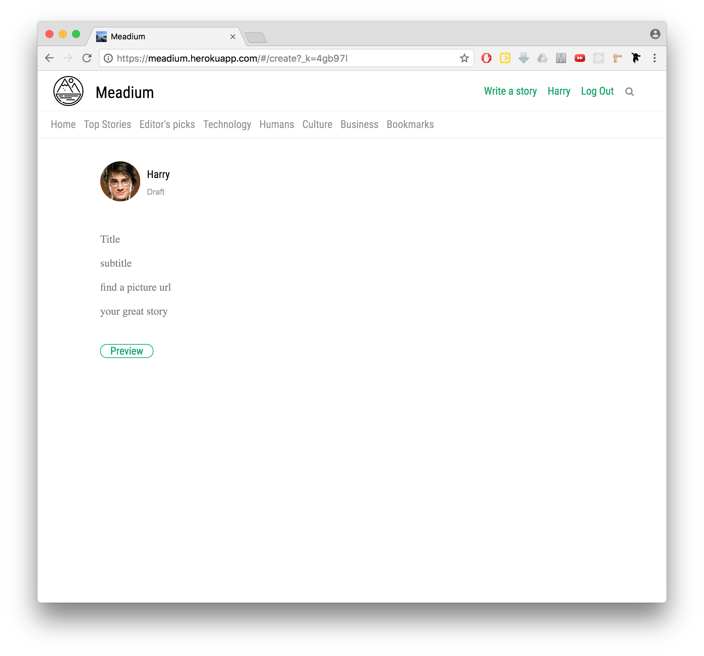

# Meadium

[Meadium] is a news and media web application inspired by Medium, where users can read, comment, and like stories about the body of water formed by the Hoover Dam. Users can also follow authors and view a feed tailored to their specific interests.

Meadium utilizes Ruby on Rails on the backend and React.js on the frontend, with a Redux architecture.



[Meadium]: https://meadium.herokuapp.com/#/index?_k=uo1mys

## Features

  * Authentication
  * Stories
  * Comments
  * Likes
  * Follows
  * Feed

### Authentication

Meadium uses the BCrypt ruby gem in the backend to take in a user's password and store it in the database as a password digest. The login page is rendered on the frontend as a React modal component.



### Stories

Users can read stories and create their own. Stories are saved in the database and access to the API comes through the rails stories controller.  

When creating a new story a user has the ability to preview how the story will looking by clicking a preview button.



This is all handled within the same component -- the story information is saved in the component state and an additional state property --  "mode" can be toggled between "preview" and "edit". In "preview" mode the story is rendered with the information from the component state.

The actual render function for this component is very simple, where renderForm and renderPreview are react functions that return the appropriate HTML:

```javascript

class NewStory extends React.Component {
    ...

  state = {... mode: "edit"}

  handleRender(){
    if (this.state.mode == "edit"){
      return this.renderForm();
    } else {
      return this.renderPreview();
    }
  }

  render(){
    return(
      <div>
       {this.handleRender()}
      </div>
    );
  }
}  

```


### Comments

  A user can comment on any story, as long as that user is logged in. Comments are stored in the database with a column for for `story_id`, a column for `user_id`, and a `body` column for the actual comment.

### Likes

  A logged-in user can like any story. Likes connect users and stories through a join table. When the stories are loaded from the database, rails uses associations to pull in all the likes for that story as well.

### Follows

  A logged-in user can follow other authors. When a user signs in, the app fetches all the authors the user is following. That way the app can have access to that information to put together a user's feed, as well as knowing whether to display the "follow" or "following" button when a user is browsing authors.

### Feed

  After a user logs in, the main index page becomes the users feed. The feed is put together from an active record query on the backend that finds all the stories with authors the user is following. As soon as a user follows a new author an action is dispatched that fetches the new feed from the database, and sends that information to the feed reducer. A user can then check out their feed and see new stories!

## Project Design

Meadium was built from a rails base in two weeks.

To help structure the project and give an implementation timeline during the development process I put together a project [proposal] and a [database schema].

[proposal]: docs/README.md
[database schema]: docs/schema.md

## Future Features

Meadium in it's current state is a functioning web application. However there are several features I plan to implement.

### Rich Text Editing

I plan to use the new react library Draft.js to add rich text editing to the app. This way users can style their stories.

### Search

I plan to add a search bar that will live search for username or story name (or eventually tag name).

### Tags, Bookmarks

To make the site more useable and searchable I plan to include the ability for users to add tags to their stories.
